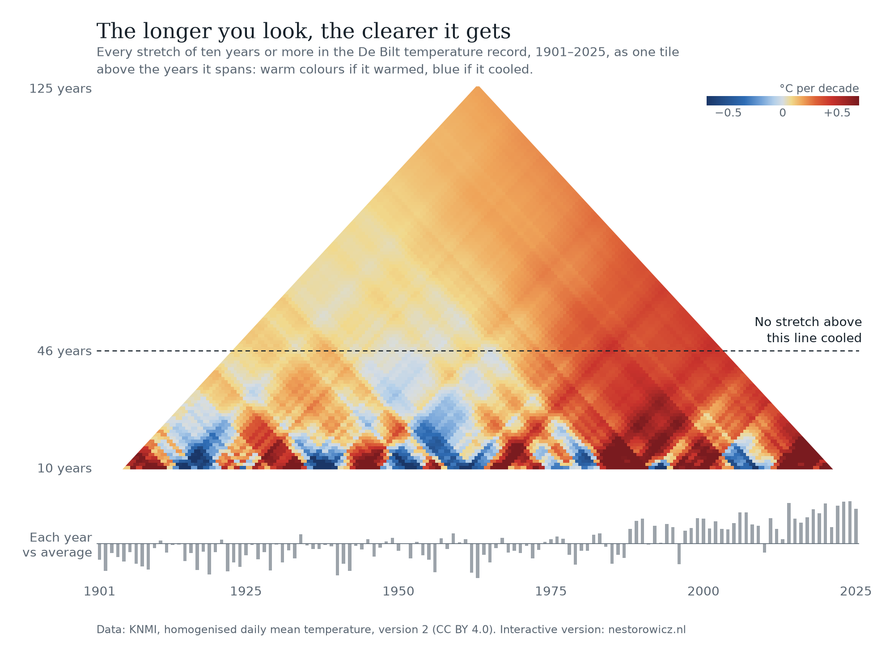

# nestorowicz.nl

My homepage: one page with three views, switched from the menu: two interactive visualisations, Climate and Training, and About me, my CV. The page is a single self-contained HTML file with its data inside it: no dependencies, cookies, trackers or external requests. To preview, open `index.html` in a browser.

```text
nestorowicz.nl/                                                           licence
├── index.html                     the page: Climate, Training, About me   code AGPL, data CC BY, text ©
├── climate/
│   ├── triangle.py                every climate number, the static image  AGPL-3.0-or-later
│   ├── triangle.png               static version of the visualisation     CC BY 4.0
│   └── DeBilt-TG-allversions.csv  KNMI source data, unchanged             CC BY 4.0, © KNMI
├── sport/
│   ├── sanitise_strava.py         Strava export to sessions.csv           AGPL-3.0-or-later
│   └── sessions.csv               published training data                 CC BY 4.0
├── about/
│   ├── make_pdf.py                About me as a one-page PDF CV           AGPL-3.0-or-later
│   └── toni-nestorowicz-cv.pdf    generated CV, not committed             text ©
├── LICENSE                        AGPL-3.0 text, shown by GitHub
├── LICENSE-DATA                   CC BY 4.0 text
└── README.md
```

The menu sticks to the top once you scroll, and the name joins it on the right once the header is out of view. Each view ends with links to the others. `index.html` is 216 KB, 73 KB compressed, of which 32 KB is the training data and 20 KB the portrait. All three scripts need only [uv](https://docs.astral.sh/uv/), which fetches Python and the dependencies on first run.

## The longer you look, the clearer it gets



Every stretch of ten years or more in the De Bilt temperature record, 1901–2025, is one tile above the years it spans: warm colours if it warmed, blue if it cooled. Short stretches go both ways, but no stretch of 46 years or more cooled, and the 46 years to 2025 warmed almost three times as fast as the 46 years to 1960.

```sh
cd climate
./triangle.py                       # prints every number quoted on the page, writes triangle.png
./triangle.py --out triangle.svg    # any format matplotlib writes
./triangle.py --trends trends.csv   # every stretch, its trend and its 95% interval
./triangle.py --embed ../index.html # write the 125 annual means into the page
./triangle.py --fade                # fade stretches whose interval includes zero
```

```text
125 complete years, 1901–2025: 6,786 stretches of 10 years or more
10-year stretches: 72 warmed, 44 cooled
longest cooling stretch: 45 years, 1943–1987 at -0.0164 °C per decade
weakest 46-year stretch: 1934–1979 at +0.0040 °C per decade
whole record: +0.186 °C per decade
46 years to 1960: +0.153, 46 years to 2025: +0.439 °C per decade (2.9 times as fast)
lag-1 autocorrelation of the noise: 0.1296
10-year stretches clear of zero: 4 of 116; stretches under 20 years whose interval includes zero: 96%
```

**Method.** Daily mean temperature is taken from the `version2` column, averaged per complete calendar year and rounded to 0.01 °C. Each stretch gets an ordinary least-squares slope in °C per decade and a 95% interval. The interval uses the effective sample size of Santer et al. (2008), [doi:10.1002/joc.1756](https://doi.org/10.1002/joc.1756), because year-to-year noise is slightly persistent (lag-1 autocorrelation measured around a cubic fit). Colour runs from grey through yellow, orange and red for warming and through deepening blue for cooling, at full strength from 0.7 °C per decade. Computing the trend of every possible period is established; see Liebmann et al. (2010), [doi:10.1175/2010BAMS3030.1](https://doi.org/10.1175/2010BAMS3030.1), and Hannaford et al. (2013), [doi:10.5194/hess-17-2717-2013](https://doi.org/10.5194/hess-17-2717-2013). The page recomputes all of this in the browser from the embedded annual series and agrees with the script on every one of the 6,786 tiles, faded or not.

**Limits.** One station; the uncertainty of the homogenisation is not shown, and KNMI deliberately does not correct for gradual changes around the station such as urbanisation. Overlapping stretches share most of their years, so the tiles are not independent evidence and the fade is a guide rather than a formal test. The 46-year threshold is a knife edge: the longest cooling stretch cools by 0.016 °C per decade and the weakest 46-year stretch warms by 0.004. The visualisation shows how the temperature changed, not why.

**Data.** De Bilt only, from KNMI’s [homogenised daily temperature dataset for the five principal stations](https://dataplatform.knmi.nl/dataset/homogenization-daily-temperature-principal-stations-netherlands-1-0), version 2.0, described in de Valk and Brandsma (2026), KNMI report WR-26-01. It holds the raw series (`original`) and both homogenised versions from 1 January 1901. © KNMI, [CC BY 4.0](https://creativecommons.org/licenses/by/4.0/).

## How my training branched out

One branch per sport, sprouting at my first session; each hair is a week, longer for more hours. Walking counts as cross-training. Below the branches, four small multiples track pace, speed, share of active days and sessions per active day by calendar year.

```sh
cd sport
./sanitise_strava.py path/to/activities.csv sessions.csv --embed ../index.html
```

`activities.csv` comes from Strava’s bulk export (on strava.com: Settings, My Account, Download or Delete Your Account, Request your archive). The script keeps four columns: the local date, the sport, moving time in minutes and, only for runs over 1 km and outdoor rides over 5 km, distance. Start times, titles, notes, gear, routes, heart rate and everything else never leave your computer, and `.gitignore` keeps the raw export out of the repository. Rides on a Wattbike or titled ‘indoor’ become indoor rides, sessions logged as generic training with ‘krachttraining’ or ‘strength’ in the title become strength, hikes become walks, and other sports (skating, badminton) are dropped. Pinned dependencies make the output byte-identical for the same export.

`--embed` writes the same bytes into the page, between `<script id="sessions" type="text/csv">` and `</script>`. The page computes every number and sentence from them, so they stay true when the data is rebuilt. Weeks run Monday to Sunday; all branches share one scale. A branch leaves the cycling stem at the date of the sport’s first session, and the lanes are ordered so that no branch crosses a lane that already exists. The small multiples use complete calendar years plus the current year so far, drawn hollow. Pace is total moving time divided by total distance, speed is total distance divided by total moving time, and indoor rides are left out of speed because their speeds are simulated.

## About me

The CV is the page’s third view. `make_pdf.py` renders that view as a one-page A4 PDF, using the print styles in `index.html`, in the Chromium browser that Playwright drives, so the PDF matches the page but carries none of the date, address and page numbers a browser adds when printing. The first run downloads that Chromium build, about 150 MB. The PDF is generated, so `.gitignore` keeps it out of the repository: it is made fresh whenever the site is published, and can never be older than the page.

```sh
cd about
./make_pdf.py
```

## Updating

- **Training data:** run the sanitiser with `--embed ../index.html` and commit `index.html` and `sport/sessions.csv`. Nothing else changes.
- **A new year of temperature data:** replace the KNMI file, change `last` in `annual()` and run `./triangle.py --embed ../index.html`. The sentences around the climate visualisation quote the script’s printout, so update them from it.
- **The CV:** edit the About me section of `index.html`. The PDF follows when you next publish.

## Publishing

The site is four files, uploaded to the web root with their folders: `index.html`, `about/toni-nestorowicz-cv.pdf`, `sport/sessions.csv` and `climate/triangle.png`. Everything else stays in this repository. Make the PDF first, since the repository does not keep it, then upload. For example:

```sh
(cd about && ./make_pdf.py)
rsync -avR index.html about/toni-nestorowicz-cv.pdf sport/sessions.csv climate/triangle.png user@host:public_html/
```

The server should compress text (gzip or Brotli): `index.html` shrinks from 216 KB to 73 KB.

## Licences

- **Code**, meaning the three scripts and the markup, styles and scripts of `index.html`, is free software under the [GNU Affero General Public License v3.0 or later](LICENSE). Anyone who runs a modified version for others, including as a website, must publish its source under the same licence.
- **Data and images**, meaning `sessions.csv`, the training data embedded in `index.html` and `triangle.png`, are under [CC BY 4.0](LICENSE-DATA). Credit them as “Toni Nestorowicz, nestorowicz.nl”. The KNMI data stays under KNMI’s own CC BY 4.0 and needs its own credit: “© KNMI”.
- **Text**, meaning the CV, its PDF and the sentences on the page, is © Toni Nestorowicz, all rights reserved.

The scripts carry [SPDX](https://spdx.dev) headers and the page opens with a one-line notice, so every file states its licence where it is used.
